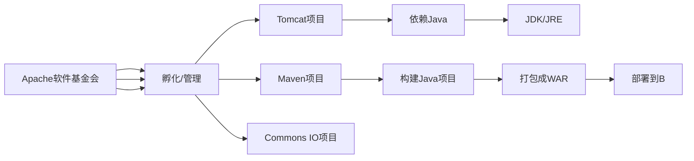

# Apache(Maven)与 Tomcat:Java Web 开发的关键关系解析

  

**在Java代码审计中，如果项目启动报错，很可能是是因为maven和tomcat等等关系，maven是属于Apache的产品，所以我们先来了解一下这两个东西。**

**我们先明确 Apache 和 Tomcat 在 Java 开发中各自的定位、含义，以及它们之间的关系，这是理清 Java Web 开发生态的关键一步。**

### 一、先拆清楚两个核心概念

#### 1. Apache（阿帕奇软件基金会）

- **定义**：Apache 不是某个具体的软件，而是一个**全球性的开源软件基金会（Apache Software Foundation，ASF）**，成立于1999年，是开源界最有影响力的组织之一。

- **核心作用**：

    - 孵化、管理大量顶级开源项目（覆盖Java、大数据、服务器、工具等领域）；

    - 制定开源规范，提供开源项目的协作、维护、分发平台。

- **通俗理解**：Apache 相当于一个“开源软件的超级孵化器/管理公司”，旗下有无数优秀的开源“产品”，Tomcat 就是其中之一。

- **Java 领域常见的 Apache 项目**：

|    项目名|    用途|
|---|---|
|    Tomcat|    Java Web 容器|
|    Maven|    项目构建/依赖管理工具|
|    Commons Lang/IO|    Java 基础工具库|
|    HttpClient|    HTTP 客户端工具|
|    Hadoop|    大数据分布式存储/计算框架|

#### 2. Tomcat（Apache Tomcat）

- **定义**：Tomcat 是 Apache 基金会管理的**开源 Java Web 容器**（也叫 Servlet 容器），是 Apache 旗下的一个具体项目，专门解决 Java Web 应用的运行问题。

- **核心定位（Java 开发中）**：

    - 实现了 Java EE（Jakarta EE）规范中的 **Servlet/JSP 规范**，是运行 Servlet、JSP、Filter 等 Web 组件的核心载体；

    - 本质是一个轻量级的 HTTP 服务器 + Java Web 容器，既能接收浏览器的 HTTP 请求，又能运行 Java Web 代码；

    - 是 Java Web 开发中最主流、最基础的运行环境（中小型项目首选，大型项目常与 Nginx 配合使用）。

- **通俗理解**：Tomcat 是 Apache 基金会“出品”的一款专门给 Java Web 应用“安家”的软件——你写的 Java Web 代码（如网站、接口）本身无法直接对外提供服务，必须部署到 Tomcat 中，由 Tomcat 接收请求、运行代码、返回结果。

    

### 二、Apache 和 Tomcat 的关系 + 与 Java 开发的关联

#### 1. 两者的核心关系

简单说：**Tomcat 是 Apache 基金会旗下的一个具体开源项目，专门服务于 Java Web 开发；Apache 是 Tomcat 的“母公司/管理方”**。

#### 2. Tomcat 在 Java 开发中的具体作用（落地场景）

假设你开发一个 Java Web 接口（如用户登录接口）：

- ✅ **步骤 1**．你用 Java 语言写 Servlet 代码（处理登录逻辑），基于 JDK 编译；

- ✅ **步骤 2**．用 Maven（也是 Apache 项目）把代码打包成 WAR 包；

- ✅ **步骤 3**．把 WAR 包放到 Tomcat 的 `webapps` 目录下，启动 Tomcat；

- ✅ **步骤 4**．Tomcat 启动时会加载这个 WAR 包，初始化 Servlet；

- ✅ **步骤 5**．浏览器/前端调用 `http://localhost:8080/你的项目名/login`，Tomcat 接收请求，找到对应的 Servlet 执行，返回登录结果。

  

#### 3. 补充：Tomcat 与其他服务器的区别（帮你定位）

- **对比 Apache HTTP Server（常简称“Apache 服务器”）**：

  - 这是 Apache 基金会的另一个项目，是纯 HTTP 服务器（用 C 语言开发），只能处理静态资源（HTML/CSS/图片），**不能运行 Java 代码**；
  - 实际开发中，常把 `Nginx` / `Apache HTTP Server` 作为前端反向代理，`Tomcat` 作为后端应用容器，配合使用（静态资源由前端处理，动态 Java 请求转发给 `Tomcat`）。

- **对比 Jetty / JBoss**：

  - `Jetty`：也是 Java Web 容器，轻量、高性能，常用于嵌入式场景（如 `Spring Boot` 内置）；

  - `JBoss`：重量级应用服务器（包含 `Tomcat` 核心），支持更多 Java EE 规范，适合大型企业级项目；

  - `Tomcat`：平衡了轻量和功能，是中小项目的首选。

    

### 总结

1. **Apache** 是开源基金会，不是具体软件，管理着 `Tomcat`、`Maven` 等大量 Java 领域的核心开源项目；
2. **Tomcat** 是 Apache 旗下的 Java Web 容器，是运行 Java Web 应用（`Servlet`/`JSP`）的核心工具，是 Java Web 开发的基础环境；
3. 在 Java 开发中，`Tomcat` 是连接你的 Web 代码和外部请求的“桥梁”，而它的归属和维护由 Apache 基金会负责。

简单记：Apache 是“组织”，Tomcat 是该组织开发的、给 Java Web 代码“运行起来”的核心软件。