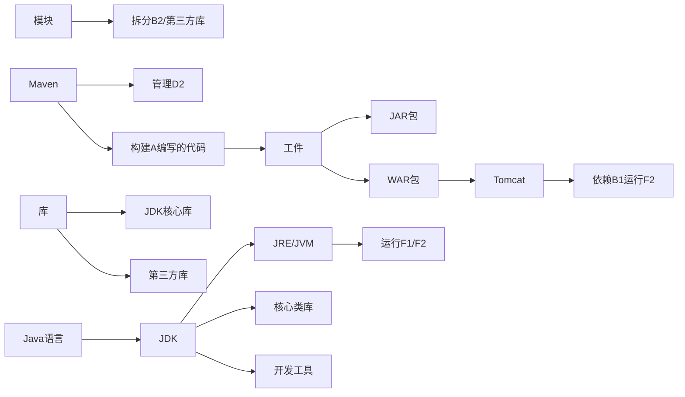

# Java开发的各种名词

你被JDK、Java、Tomcat、Maven这些概念以及“模块、库、工件”这些术语搞混了，想弄清楚它们各自的定义、相互关系和联系，这个问题是Java开发入门的核心，理清这些能帮你建立完整的Java技术体系认知。

### 一、先逐个讲清楚每个概念的核心定义

#### 1. Java（核心语言）

- **定义**：Java是一门**面向对象的编程语言**，同时也是一套包含语言语法、运行环境、类库的完整技术体系。

- **通俗理解**：就像“中文”一样，是一套沟通规则（语法），你用它写“文章”（代码），但需要“笔和纸”（工具）、“阅读环境”（运行时）才能落地。

#### 2. JDK（Java开发工具包）

- **定义**：JDK（Java Development Kit）是开发Java程序的**核心工具包**，是Java技术体系的基础。

- **包含内容**：

    - JRE（Java运行环境）：运行Java程序必需的环境（JVM + 核心类库）；

    - 开发工具：编译工具（javac）、运行工具（java）、调试工具（jdb）等；

    - 核心类库：Java自带的基础功能库（如java.lang、java.util、java.io等）。

- **通俗理解**：相当于“中文写作套装”——包含“字典”（类库）、“钢笔”（编译工具）、“阅读器”（JRE），没有它既写不了Java代码，也跑不了Java程序。

#### 3. Tomcat（Web服务器/容器）

- **定义**：Tomcat是Apache基金会的**开源Java Web容器**，实现了Servlet/JSP规范，是运行Java Web应用的核心服务器。

- **核心作用**：

    - 接收浏览器的HTTP请求，交给Web应用处理；

    - 运行Servlet、JSP等Web组件，返回处理结果给客户端；

- **通俗理解**：相当于“Java Web应用的房子”——你写的Web代码（如网站、接口）必须放在Tomcat里才能对外提供服务，就像商店要开在“商铺建筑”里才能营业。

#### 4. Maven（项目构建/依赖管理工具）

- **定义**：Maven是Apache的**项目管理和构建工具**，核心解决两个问题：

    - 依赖管理：自动下载、管理项目需要的第三方库；

    - 项目构建：标准化编译、打包、测试、部署Java项目。

- **通俗理解**：相当于“Java项目的管家”——帮你“采购”需要的“零件”（第三方库），并按固定流程“组装”（编译、打包）你的项目成可运行的成品。

#### 5. 模块（Module）

- **定义**：

    - Java 9+引入的**模块系统（Module System）**：将Java的类库/代码按功能拆分，每个模块有明确的边界（声明依赖、暴露的接口），解决“类路径地狱”问题；

    - 广义上：项目中按业务/功能拆分的代码单元（如用户模块、订单模块），也是“模块”。

- **通俗理解**：相当于“乐高积木”——把复杂的Java程序拆成一个个独立的“积木块”，每个积木块只负责一个功能，可单独开发、复用，且明确说明“依赖哪些积木”“对外提供哪些功能”。

#### 6. 库（Library）

- **定义**：库是一组预先编写好的Java类/方法的集合，封装了特定功能，供开发者直接调用，无需重复造轮子。

- **分类**：

    - 核心库：JDK自带（如java.util.ArrayList）；

    - 第三方库：如Spring、MyBatis、Apache Commons IO。

- **通俗理解**：相当于“工具包”——比如你要拧螺丝，不用自己造扳手，直接用现成的“扳手工具”（库）就行。

#### 7. 工件（Artifact）

- **定义**：Artifact是Maven中对“可交付的成品”的统称，是项目构建后生成的文件（如JAR、WAR、EAR包）。

- **核心特征**：每个工件有唯一标识（GAV：GroupId + ArtifactId + Version），比如`org.springframework:spring-core:6.0.0`。

- **通俗理解**：相当于“工厂生产的成品”——Maven把你的代码+依赖打包成“成品”（JAR/WAR），这个成品就是工件，可直接部署运行。

### 二、用“关系图”理清它们的联系

#### 更通俗的关系拆解

1. **基础层**：Java是“语言规则”，JDK是“开发/运行Java的基础工具包”——你用Java语法写代码，必须基于JDK提供的工具（javac编译）和核心库（如ArrayList）。

2. **代码组织层**：模块是“代码的拆分方式”——把JDK的库/你写的代码/第三方库拆成独立模块，降低复杂度。

3. **功能复用层**：库是“现成的功能包”——核心库来自JDK，第三方库（如Spring）需要Maven帮你管理。

4. **构建交付层**：Maven是“管家”——把你写的代码+依赖的库，按模块打包成“工件”（JAR/WAR）。

5. **运行层**：

    - JAR包：直接用JDK的JRE运行；

    - WAR包：需要部署到Tomcat（依赖JRE）运行（Tomcat本身也是Java程序，需JDK/JRE支撑）。

### 三、举个实际开发例子，帮你落地理解

假设你要开发一个Java Web项目（如电商网站）：

1. **写代码**：用Java语言，基于JDK的核心库（如String、List）写代码，按“用户模块、订单模块”拆分代码（模块）；

2. **用库**：需要操作数据库，直接用MyBatis第三方库（不用自己写数据库连接代码）；

3. **管理依赖**：用Maven配置MyBatis的GAV（`org.mybatis:mybatis:3.5.13`），Maven自动下载这个库到项目中；

4. **构建项目**：Maven把你的代码+MyBatis库打包成WAR包（工件）；

5. **运行项目**：把WAR包部署到Tomcat，Tomcat依赖JDK的JRE运行，对外提供电商网站服务。

### 总结

1. **核心基础**：Java是语言，JDK是开发/运行Java的核心工具包（含JRE和核心库）；

2. **代码组织与复用**：模块是代码的拆分方式，库是可复用的功能包（分JDK核心库和第三方库）；

3. **构建与交付**：Maven管理第三方库、打包代码成工件（JAR/WAR）；

4. **运行部署**：JAR包直接用JRE运行，WAR包需部署到Tomcat（依赖JRE）运行。

这些概念层层递进，从“写代码”到“跑代码”，覆盖了Java开发的全流程，理清后就能明白每个工具/术语在开发中的具体作用了。
